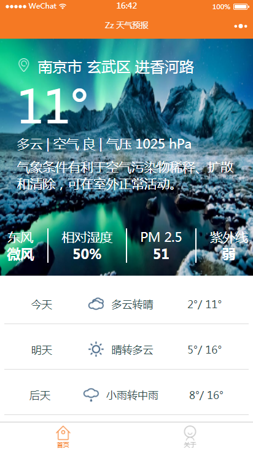
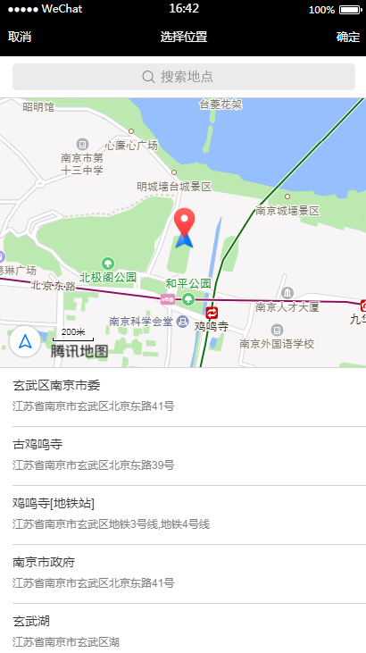
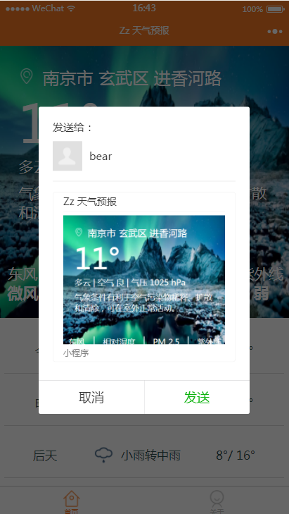

# 微信小程序 -- Zz天气预报

## Change Log
- 2018-09-19： 1,新增PM2.5显示

- 2018-05-17： 1,修复和风天气接口字段修改后，导致无法展示问题

- 2017-11-24： 1,新增 底部导航 2，新增 "关于" 页面

- 2017-11-23： 1,增加小程序转发分享功能 2, 新增下拉刷新，优化展示方式 3, 新增 打开地图选择位置 获取天气信息

- 2017-11-22： 1,背景图随机更换 2，微信web开发者工具升级后，[所有程序都报 wxss 编译错误](http://www.aiyingli.com/50384.html)。（尝试在控制台输入 openVendor() ，清除里面的 wcsc 和 wcsc.exe 然后重启工具）

## 截图：

License
-------

    Copyright 2017 yangxiaoge.

    Licensed under the Apache License, Version 2.0 (the "License");
    you may not use this file except in compliance with the License.
    You may obtain a copy of the License at

       http://www.apache.org/licenses/LICENSE-2.0

    Unless required by applicable law or agreed to in writing, software
    distributed under the License is distributed on an "AS IS" BASIS,
    WITHOUT WARRANTIES OR CONDITIONS OF ANY KIND, either express or implied.
    See the License for the specific language governing permissions and
    limitations under the License.
